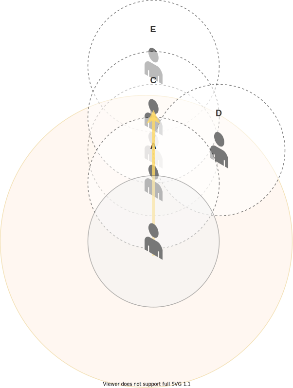
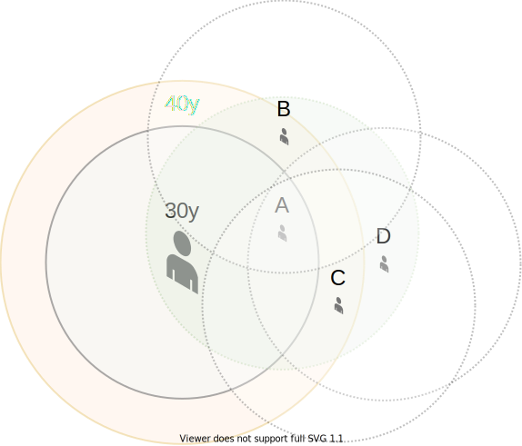

## T15

### Castigation

Castigation is not a consideration and would require offensive penance to see significant buffs in order to place it near the alternatives in this tier.

### Twist of Fate

Twist of Fate can be useful in pushing M+ content, however in raids it will rarely see play unless there are specific mechanics that allow you to abuse the uptime of the buff.

### Schism

Schism is the obvious choice in the majority of situations when ramping is your primary consideration, as it allows you to improve the strength of your ramp windows, Schism is also very mana efficient and hits hard before considering the damage buff.

## T25

### Body and Soul

Do not take Body and Soul, you _will_ kill someone by speeding them up in combat when they did not expect it.

### Masochism

Significantly buffs the strength of Shadow Mend on the player. This is a consideration for when you need extra EHP to survive, but you should consider the opportunity cost as Angelic Feather is a high cost to pay. Look at customising conduits before selecting this talent.

### Angelic Feather

Strong default pick, Priest has no baseline movement abilities so in almost all situations this talent is very strong for affording better positioning options to the priest during most if not all raid encounters.

## T30

### Shield Discipline

Shield Discipline is not a consideration, it provides slightly more mana if you can get every shield you put into play depleted, but allows for no flexibility with regards to output. It's also boring and prone to getting worse as your character gets stronger, which is not the hallmark of a good talent pick.

### Mindbender

Mindbender will do around 60% of a Shadowfiend's damage in a slightly shorter timeframe, depending on haste it represents around 1.5%-3.5% more mana every 3 minutes than Shadowfiend due to the newly added [base mana return](https://shadowlands.wowhead.com/spell=343726/shadowfiend).

Mindbender enjoys synergy with Spirit Shell, as they both have one minute cooldowns, this removes concern with not using Mindbender efficiently as you can almost certainly make perfect use of the ability with Spirit Shell.

### Power Word: Solace

Power Word: Solace represents a 1.4% mana gain per cast as it typically replaces a Smite, meaning at perfect use you're looking at 5.6% net mana per minute. The caveat is that using Power Word: Solace perfectly is not optimal, with most logs seeing 60-80% use. Solace also has notable anti-synergy with Shadow Covenant in the later tiers, which may inform your decision on this tier.

## T35

### Psychic Voice

Psychic Voice has notable synergy with the [Mental Recovery](https://shadowlands.wowhead.com/spell=337954/mental-recovery) conduit, for certain M+ affixes such as [Spiteful](https://shadowlands.wowhead.com/affix=123/spiteful) this can be powerful.

### Dominant Mind

Dominant Mind is a dead talent, there is no known situation in M+ that allows this talent to be a significant choice. (Nor has there been for several years).

### Shining Force

Shining Force is the default pick here, a knockback is a strong tool for Discipline and Shining Force has one of the largest knockback ranges in the game.

## T40

### Sins of the Many

Sins of the Many allows the Priest to opt into stronger individual Atonements when the total count of Atonement is lower. This means that Atonement becomes marginally stronger when you aren't ramped. This is a strong choice for both mana efficiency and output in M+, and is the best choice to conserve mana in raiding content.

Note that Sins of the Many has a floor value of 3%, meaning it cannot go lower than that value.

### Contrition

Contrition allows the priest to remove a portion of the opportunity cost involved with casting a defensive Penance. Unfortunately, Penance is in a poor situation right now with the baseline version being worth less to cast than a Shadowmend on targets that are taking damage. Consequently, the number of situations where the Priest is interested in reducing that opportunity cost is almost zero.

### Shadow Covenant

Shadow Covenant is an extremely high risk but high reward button, allowing the priest to benefit from 25% extra Shadow output but at the cost of 5% mana and not being able to use Holy spells. There is significant synergy with Covenant selection here, Priests that choose the Venthyr Covenant will be much more interested in this spell as Mind Games is the only notable source of Shadow Damage available to Discipline other than Schism.

## T45

### Purge the Wicked

In any situation you can benefit from the cleave effect of Purge the Wicked, it is almost certainly the best choice. Pick this as a default, there are only a few situations where the alternatives become competitive and they are all in raid content.

On a single target, Purge the Wicked will tick for roughly 50% more than a Shadow Word: Pain. Consider choosing Halo and Divine Star as a micro-optimisation, as the associated costs and complexity of use rarely outperform the strength of Purge the Wicked.

### Divine Star

Take Divine Star if you can hit 6 targets reliably and there is only a single opponent, when Divine Star can hit 6 targets reliably it becomes roughly 70-90% as strong as a full Halo but with a third of the cooldown. The caveat with Divine Star is that it has a huge associated cost with casting, and it does not synergise especially well with your Atonement count due to the small 40% spellpower hit only counting on the way forward and not the way back.

#### Divine Star Diminishing Returns

Divine Star has a different diminishing return mechanism than most other spells in the game, for the sake of simplicity I'm going to call it "cluster DR". Instead of applying diminishing returns instantly, as most other spells work, Divine Star will snapshot diminishing returns at cast time and only apply the values if Divine Star hits the target.

In order for this to work, there are three key variables that are used to determine the snapshot values, they are,

- A 24 yard range for healing players
- An 18 yard "cluster" radius
- A 40 yard total radius for player consideration

This can be seen illustrated below,

Consider the yellow arrow in the diagram to be the travel path of Divine Star, it will hit 4 players in it's path. Those players are the Priest, Player A, Player B, and Player C.

Each player has a different `N` value that is considered for the meteoring calculation, the determining factors for each player are as follows,

- The Priest has an `N` value of 2, as Player A is within the 18 yard cluster radius.
- Player A has an `N` value of 3, as both the Priest and Player B are within the 18 yard cluster radius of them.
- Player B has an `N` value of 4, as Players A, C, and D are within the cluster radius of them.
  - Note that despite Player D not being in the path of Divine Star, they are still considered for the meteor value in Player B's case.
- Player C has an `N` value 2, Player E and Player B are within range, however Player E is outside of Divine Star's 40 yard consideration radius.

### Halo

The conditions for playing Halo and Divine star are almost the same, but Halo interacts much better with Atonement - meaning that if you can reliably ramp every 45 seconds on a single target it will probably pull ahead.

It probably goes without saying that you can't use this in M+ without killing your group.

#### Halo Diminishing Returns

Similarly to Divine Star, Halo also has a cluster DR, meaning that at cast time it computes the appropriate values for each player _if it hits them_.

Here is the information about how Halo clusters,

- It has a 30 yard radius for healing players
- It has a 30 yard cluster radius
- It has a 40 yard total radius for player consideration

This can be seen illustrated below,

Player A and the Priest are the only players being hit by Halo, however they both have different considerations for meteoring,

- Player A is the only person within the cluster range (30y) of the Priest, meaning that the priest has an N value of 2 for meteoring purposes
- Player A has 5 people total, including themselves, in range of the 30y cluster radius. However, we subtract 1 for player D who is outside of the considered radius (40y)
- Player B and C are considered, but not hit by the heal, if they were to move in to the effect after the cast they would each be healed with a consideration of N=2.
- Player D is not considered, meaning that if they were to move in to the effect they would be healed with N=1 as a consideration for meteoring.

For simplicity sake, there are only 5 players in this diagram. Cluster meteoring is gameable, if 19 players were to stand at D and teleport into the 30 yard range of Halo after the cast, it is assumed they would all be healed for the full value of Halo, meaning you more than triple the total healing of the spell. Conversely, if there were 15 players stacked on C, player A would receive very little healing as their N value for meteoring shoots up to 18!

## T50

### Lenience

Take this in M+ for most situations, it is uninteresting but 3% damage mitigation is a strong effect to have when consistently taking damage and pushing keys. When you have Lenience it should be a priority to keep Atonement on your tanks, as they will usually be taking the majority of the damage.

### Spirit Shell

A set of extremely _low quality_ decisions on behalf of the developers has continued over the last couple of months or so of the beta, in which the [Spirit Shell](https://shadowlands.wowhead.com/spell=109964/spirit-shell) ability has been added back. Due to this, and a combination of nerfs intended to hit Spirit Shell but ultimately missing the mark, there is very little reason to believe anything other than Spirit Shell will be competitive in Castle Nathria.

**This has finalised the choice of Covenant for most raiders on the Venthyr, as [Mindgames](#venthyr-mindgames) has exceptional synergy with Spirit Shell.**

For more information, see our page on [Spirit Shell](spirit-shell.md).

### Evangelism

The default pick for raiding in the majority of situations, pressing this button after executing a ramp will allow you to invest more damage into those Atonements and do a large amount of healing.
